# Root Cause Analysis: PR #16 Fixes Not Deployed to Production

**Date**: 2025-12-21
**Issue**: User reports "it STILL doesn't work" despite PR #16 being merged
**Affected Systems**: po.153.se (production), local VM deployment
**Severity**: High - Critical bug fixes not deployed

---

## Executive Summary

**Root Cause**: PR #16 was successfully merged to GitHub master on 2025-12-21 at 16:09:20 UTC, but the CI/CD deployment workflow **failed**, leaving production running outdated code from commit `138b618` instead of the latest commit `906597d`.

**Impact**:
- ❌ Critical bug fixes from PR #16 not deployed
- ❌ SCAR Activity Feed still broken (SSE connection fails)
- ❌ Chat Messages API still returning HTTP 500 errors
- ❌ GitHub Issues integration not available
- ❌ 16 commits behind (2,752 lines of new/changed code)

**Status**: Production is **16 commits behind** GitHub master

---

## Timeline of Events

| Time (UTC) | Event | Status |
|------------|-------|--------|
| 2025-12-21 15:53:48 | Commit `328ad60`: Critical bug fixes created | ✅ |
| 2025-12-21 16:09:20 | PR #16 merged to master | ✅ |
| 2025-12-21 16:11:42 | CD workflow triggered | ⚠️ |
| 2025-12-21 16:11:42 | CD workflow **FAILED** | ❌ |
| 2025-12-21 16:33:00 | User reports "STILL doesn't work" | 🚨 |
| 2025-12-21 16:33:00 | RCA initiated | 📋 |

---

## Detailed Analysis

### 1. What Should Have Happened


### 2. What Actually Happened

```mermaid
graph LR
    A[PR #16 Merged] --> B[CD Workflow Triggers]
    B --> C[Checkout Latest Code]
    C --> D[Build Docker Images]
    D --> E[❌ Deployment FAILED]
    E --> F[Production Still at 138b618]
    F --> G[User: 'STILL doesn't work']
```



### 3. Evidence of Deployment Gap

#### GitHub Master vs Local/Production Master

```bash
# GitHub origin/master (current, deployed: NO)
906597d Merge pull request #16 from gpt153/issue-13
7a7127d docs: Add RCA and implementation plan for WebUI fixes
3a441f9 feat: Add script to import GitHub repositories as projects
4e6d946 feat: Display GitHub issues in WebUI project navigator
f14ca6e feat: Add GitHub issues integration to WebUI
328ad60 fix: Critical bugs in SCAR feed and chat messages API
[... 10 more commits ...]

# Local master (outdated, deployed: YES)
138b618 fix: Change frontend port to 3002 to avoid conflict with SCAR
ba68336 Merge pull request #12 from gpt153/issue-11
[... older commits ...]
```

**Gap**: 16 commits, 2,752 lines added, 179 lines removed

#### CI/CD Failure Evidence

```bash
# Latest CD workflow runs
2025-12-21 16:11:42 - FAILED - "Merge pull request #16..."
2025-12-21 12:41:34 - FAILED
2025-12-20 19:54:48 - SUCCESS (last successful deployment)
```

The deployment workflow **failed** when PR #16 was merged, preventing the fixes from reaching production.

### 4. What's Missing in Production

#### Missing Critical Bug Fixes (commit 328ad60)

**File**: `src/services/scar_feed_service.py`
- ❌ SCAR feed still using `verbosity_level` @property in WHERE clause
- ❌ Still referencing `created_at` instead of `started_at`
- **Error**: `'<=' not supported between instances of 'property' and 'int'`

**File**: `src/services/project_service.py`
- ❌ Chat API still using `ConversationMessage.created_at` (should be `.timestamp`)
- ❌ Still using `msg.metadata` (should be `msg.message_metadata`)
- **Error**: HTTP 500 when fetching conversation history

#### Missing Features

**File**: `src/api/github_issues.py` (173 new lines)
- ❌ GitHub issues integration endpoints not available
- ❌ Cannot fetch issues for projects
- ❌ No issue counts API

**File**: `src/scripts/import_github_projects.py` (238 new lines)
- ❌ No way to bulk-import GitHub projects

**File**: Frontend updates
- ❌ ProjectNavigator still shows "Open Issues (0)"
- ❌ No lazy loading of GitHub issues
- ❌ Missing DocumentViewer component

#### Missing Documentation

- `RCA-WEBUI-ISSUE-13.md` (359 lines)
- `IMPLEMENTATION-PLAN-FIX-WEBUI.md` (606 lines)
- `WEBUI_DEPLOYMENT.md` (323 lines)

---

## Impact Assessment

### User-Facing Impact

| Feature | Expected (After PR #16) | Actual (Production) |
|---------|-------------------------|---------------------|
| **SCAR Activity Feed** | ✅ Live streaming | ❌ Disconnected (SSE error) |
| **Chat Interface** | ✅ Shows message history | ❌ HTTP 500 error |
| **GitHub Issues** | ✅ Shows real issues with counts | ❌ Shows "Open (0) Closed (0)" |
| **Project Import** | ✅ Bulk import script available | ❌ Not available |
| **Documentation** | ✅ Complete RCA and guides | ❌ Not deployed |

### Production Environment Status

```bash
# What's running on po.153.se
Frontend: Serves (returns HTTP 200)
Backend: Responds (/api/projects works)
SCAR Feed: 404 Not Found
Chat Messages: HTTP 500 error
GitHub Issues: Endpoints don't exist
```

### Codebase Divergence

```
Current State:
├─ GitHub master (origin/master): commit 906597d (LATEST)
├─ Local master (workspace): commit 138b618 (16 commits behind)
└─ Production (/home/samuel/po): commit 138b618 (16 commits behind)

Divergence: 2,752 additions, 179 deletions across 28 files
```

---

## Root Causes (5 Whys Analysis)

**Problem**: Production still doesn't work despite PR #16 being merged

1. **Why?** → Because the fixes from PR #16 aren't running on production
2. **Why?** → Because the CI/CD deployment workflow failed
3. **Why?** → Unknown - need to investigate the failed workflow logs
4. **Why?** → (Pending investigation of workflow failure)
5. **Why?** → (Pending investigation of workflow failure)

### Suspected Causes of CD Failure

Based on the workflow configuration and recent history:

1. **Docker build failure** (line 34: `docker compose build --no-cache`)
   - New dependencies might not install
   - Build errors in new code

2. **Service startup failure** (line 63: `docker compose up -d`)
   - New environment variables needed
   - Port conflicts
   - Database migration issues

3. **Health check failure** (line 74: waiting for http://localhost:8001/health)
   - Service crashes on startup
   - Health endpoint not responding
   - 30-second timeout exceeded

4. **Migration failure** (line 68: `alembic upgrade head`)
   - Database schema changes failing
   - Migration script errors

---

## Verification Steps

### Confirming Production is Behind

```bash
# 1. Check production endpoint
$ curl -sS https://po.153.se/api/scar-feed
{"detail":"Not Found"}  # ❌ Should exist

# 2. Check local repository
$ git log master..origin/master --oneline
906597d Merge pull request #16 from gpt153/issue-13
[... 15 more commits ...]  # ❌ 16 commits behind

# 3. Check if files exist locally
$ ls src/api/github_issues.py
ls: cannot access 'src/api/github_issues.py': No such file or directory  # ❌

# 4. Check CI/CD status
$ gh run list --workflow=cd.yml --limit 1
FAILED - "Merge pull request #16..."  # ❌
```

---

## Immediate Action Items

### Priority 1: Get Production Working (Manual Deployment)

Since CI/CD is failing, deploy manually to fix production immediately:

```bash
# On the VM (/home/samuel/po)
cd /home/samuel/po
git fetch origin
git reset --hard origin/master  # Move to latest commit
docker compose down
docker compose build --no-cache
docker compose up -d
docker compose exec -T app alembic upgrade head
docker compose ps
curl http://localhost:8001/health
```

### Priority 2: Investigate CI/CD Failure

```bash
# View the failed workflow logs
gh run view 20412460228 --log

# Common issues to check:
# - Docker build logs
# - Service startup logs
# - Database migration errors
# - Health check timeouts
```

### Priority 3: Verify Deployment Success

After manual deployment, verify each fix is working:

```bash
# Test SCAR feed
curl https://po.153.se/api/scar-feed
# Should return SSE stream, not 404

# Test chat messages
curl https://po.153.se/api/projects/89a9d011-3670-4a5e-9b3b-873e405dd350/messages
# Should return messages array, not HTTP 500

# Test GitHub issues
curl https://po.153.se/api/projects/89a9d011-3670-4a5e-9b3b-873e405dd350/issues
# Should return issues array

# Test health
curl https://po.153.se/api/health
# Should return {"status":"healthy",...}
```

### Priority 4: Fix CI/CD Workflow

Once manual deployment is verified:

1. Identify why the workflow failed
2. Fix the root cause (likely in `.github/workflows/cd.yml`)
3. Test workflow with a small change
4. Ensure future merges auto-deploy

---

## Lessons Learned

### What Went Wrong

1. **Silent failure**: User wasn't notified that deployment failed
2. **No rollback**: Failed deployment left production in broken state
3. **No monitoring**: No alert when CI/CD failed
4. **Assumption of success**: PR merge ≠ Production deployment

### What Went Right

1. ✅ PR #16 properly fixed the bugs (code review was thorough)
2. ✅ Commits were properly merged to master
3. ✅ CD workflow was triggered automatically
4. ✅ RCA process quickly identified the gap

---

## Prevention Strategies

### Short Term

1. **Add deployment status to PR**
   - Show CI/CD status in PR description
   - Require successful deployment before closing

2. **Manual verification checklist**
   ```
   After merging:
   □ Check CI/CD passed
   □ Verify production updated (git log)
   □ Test affected endpoints
   □ Confirm user issue is resolved
   ```

3. **Deployment notification**
   - Send Telegram alert when deployment succeeds/fails
   - Include link to workflow run

### Long Term

1. **Deployment health dashboard**
   - Show current production commit
   - Show deployment status
   - Show gap between production and GitHub

2. **Automated rollback**
   - If health checks fail, rollback to previous version
   - Alert team of rollback

3. **Staging environment**
   - Deploy to staging first
   - Require staging tests to pass
   - Manual approval for production

4. **Monitoring**
   - Alert on 404/500 errors
   - Alert on SSE connection failures
   - Alert when deployment lags behind GitHub

---

## Resolution Checklist

- [ ] Manual deployment to production completed
- [ ] All endpoints from PR #16 verified working
- [ ] User confirms "it works now"
- [ ] CI/CD failure root cause identified
- [ ] CI/CD workflow fixed
- [ ] Test deployment with small change
- [ ] Add deployment status monitoring
- [ ] Document manual deployment procedure
- [ ] Update team on lessons learned

---

## Related Issues

- **Issue #16**: Fix WebUI Issues - Make it Fully Functional (MERGED)
- **Issue #13**: WebUI not functional (CLOSED by #16)
- **CD Workflow**: https://github.com/gpt153/project-manager/actions/runs/20412460228

---

## Conclusion

The "STILL doesn't work" issue is caused by a **deployment pipeline failure**, not a code issue. PR #16 contains the correct fixes, but they never reached production due to a failed CI/CD workflow.

**Next Step**: Execute manual deployment to `/home/samuel/po` and verify all fixes are working.

---

**Generated**: 2025-12-21T16:33:00Z
**RCA Performed By**: @remote-agent (Claude)
**Status**: ✅ Root cause identified, awaiting manual deployment
